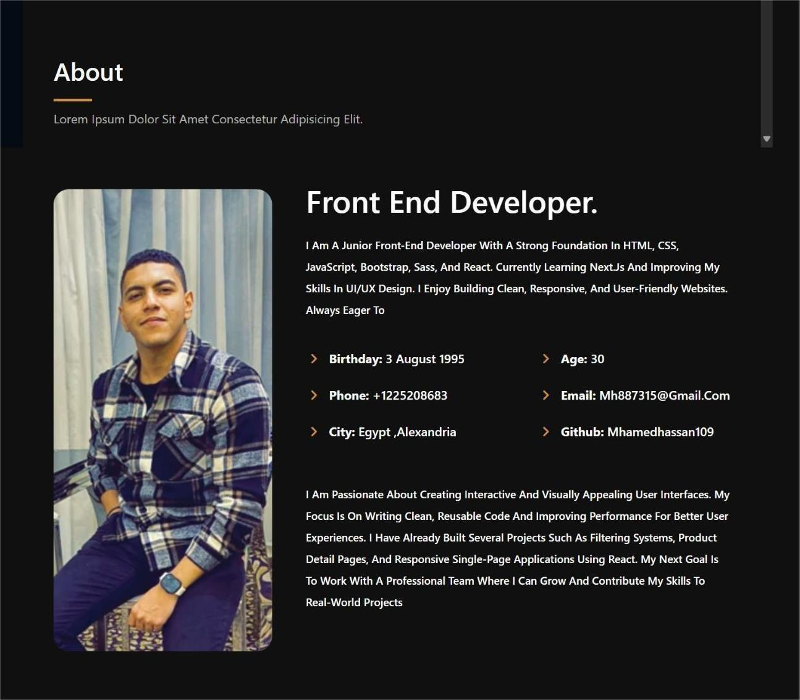
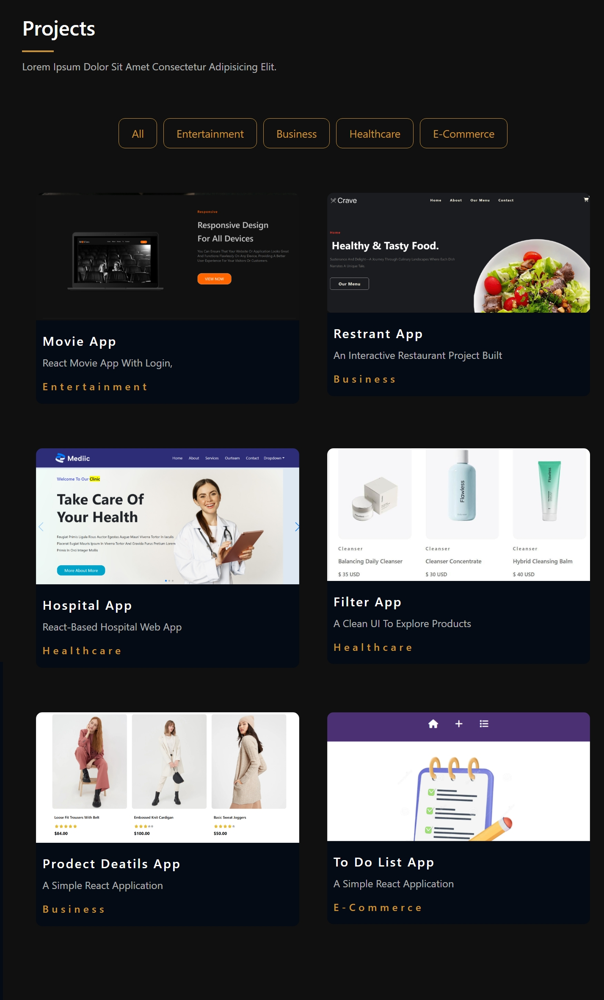
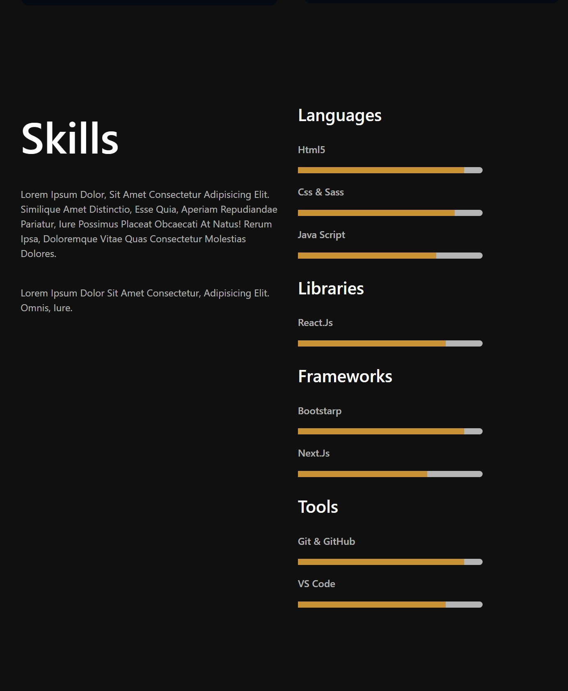
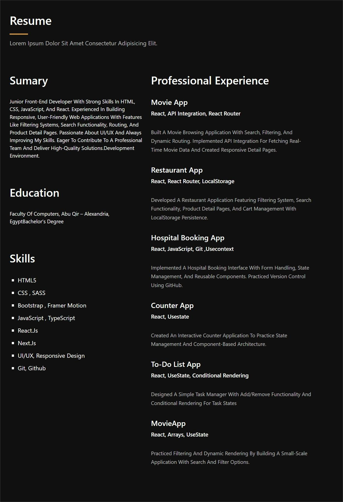
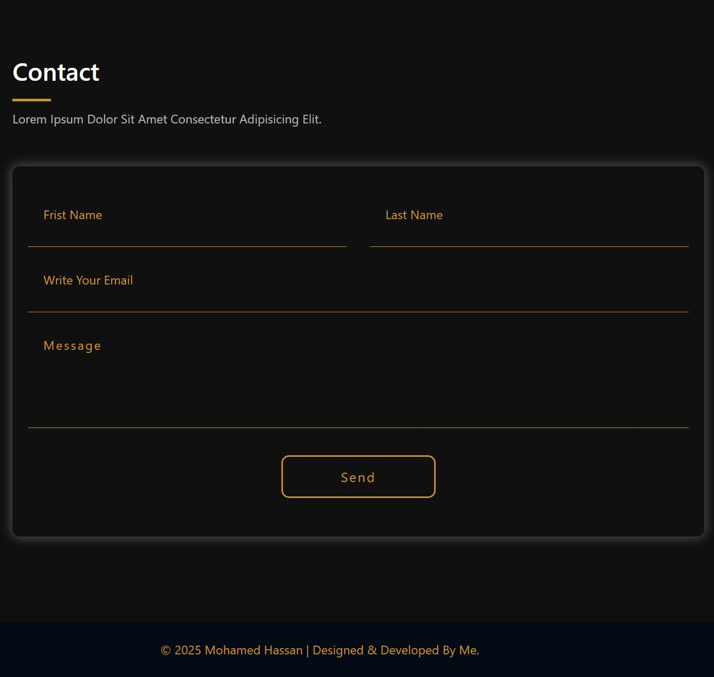

# 🌟 My Personal Portfolio

This is my personal **portfolio website**, built using **React.js** and **Sass**.  
It showcases all of my recent **projects**, **skills**, and **contact information** in a clean and modern design.

---

## 🚀 Technologies Used

- **React.js** – for building the UI components.
- **Sass (SCSS)** – for advanced and organized styling.
- **Framer Motion** – for smooth animations.
- **React Router** – for page navigation.
- **Lucide React** – for modern icons.

---

## 🖼️ Project Preview

## 📸 Project Screenshots

### 🧑‍💼 About Section

---

### 💼 Projects Section

---

### 🧠 Skills Section

---

### 📄 Resume Section

---

### 📞 Contact Section

_(Make sure you add your image inside the `src/assets` folder and rename it as `portfolio-preview.png`)_

---

## 📂 Folder Structure
